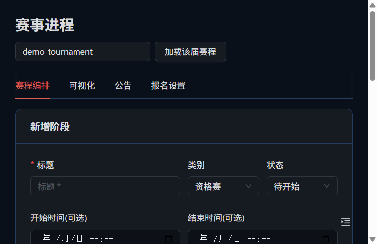
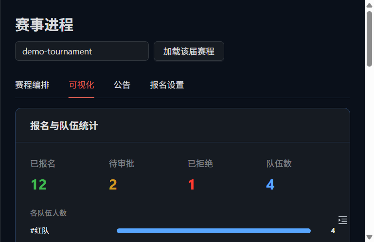
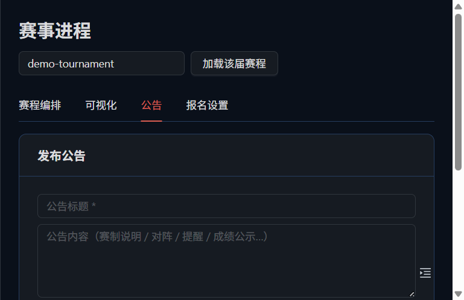
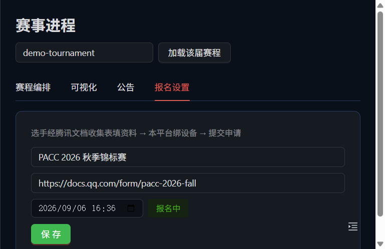
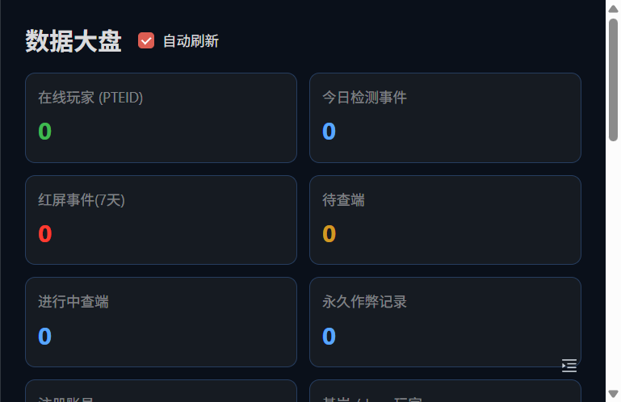
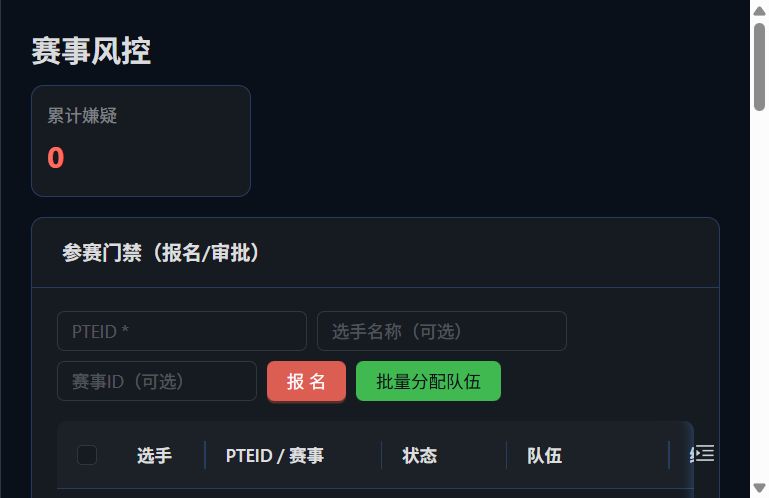
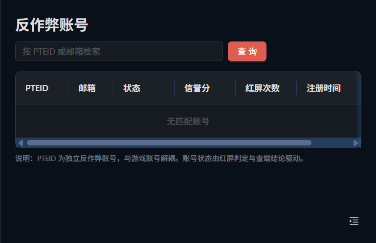

# PACC v4.0 — 企业级游戏反作弊系统（双端统一架构）

> **PACC（Professional Anti-Cheat Client）v4.0**：面向 Minecraft 基岩版与 Java 版双端统一的企业级纯玩家端反作弊系统。
>
> 采用 **纯玩家端检测 + PTV 管控 + 红屏强制警告 + 管理员远程查端** 架构。系统**不具备封禁玩家能力**，仅通过红屏警告、强制暂停键盘输入、全在线广播、永久记录与管理员远程查端进行威慑与取证。

## 目录结构

```
d:\pacc\
├── PACC v4.0 企业级游戏反作弊系统技术设计文档...md   # 技术设计文档
├── PACC v4.0 开发者使用说明.md                        # 开发者使用说明
├── PACC 纯玩家端反作弊系统 v3.0 技术设计文档...md      # v3.0 技术设计文档（历史基线）
│
├── proto/                  # 玩家端 ↔ PTV 统一通信协议（Protocol Buffers）
├── ptv-backend/            # PTV 管控层（Java 21 + Spring Boot 3 微服务）
├── ptv-frontend/           # PTV 管理后台前端（TypeScript + React + Vite）
├── ptv-client/             # 玩家端用户态服务（Java 21 LTS）
├── platform/               # 平台特定模块（内核驱动/Java Agent/移动端/Linux）
│   ├── java-agent/         #   Java 版探针（字节码扫描）
│   ├── kernel-windows/     #   Windows 内核驱动（CDP）
│   ├── kernel-linux/       #   Linux 内核模块（Kprobe）
│   ├── linux-daemon/       #   Linux 用户态守护进程
│   ├── android/            #   Android 客户端（NDK）
│   ├── ios/                #   iOS / iPadOS 客户端（Swift）
│   └── harmony/            #   HarmonyOS 客户端（ArkTS）
├── deploy/                 # 部署编排
│   ├── docker/             #   容器构建公共配置（Maven 镜像设置）
│   ├── gateway/            #   域名网关（admin/api/pacc/dl 四子域名 + TLS）
│   ├── gateway-go/         #   Go 边缘网关（限流 + 鉴权 + Prometheus 指标）
│   ├── dl-web/             #   PACC 客户端下载站静态资源（version.json + zip + 探针 jar）
│   ├── ai/                 #   AI 推理服务（FastAPI + NumPy，规则加权 + 统计异常）
│   ├── pipe-rust/          #   Rust 数据管道（SHA-256 指纹 + HMAC 签名 + 窗口聚合 + AES 加密）
│   ├── monitoring/         #   监控栈（Prometheus + Grafana + 告警规则）
│   ├── helm/               #   Kubernetes Helm Chart（后端/前端/MySQL/Ingress）
│   ├── k8s/                #   Kubernetes 编排（可选）
│   └── server/             #   单机生产部署（一键脚本 + .env 校验 + 冒烟）
├── tools/
│   ├── windows-gui/        # Windows 管理工具（C#/.NET 8 WPF：安装/诊断 + 探针统一更新）
│   │   ├── build-client.ps1    # 一键打包 EXE + jar + 下载站产物
│   │   └── deploy/installer.ps1 # 安装探针服务脚本
│   └── installer/          # Inno Setup 安装向导（pacc-client-installer.iss）
├── docker-compose.yml      # 一体化部署编排（Docker Compose，推荐）
├── .env.example            # 部署环境变量模板（复制为 .env 使用）
├── .dockerignore           # 容器构建上下文排除规则
└── .gitignore
```

## 核心能力

- 内存篡改检测：驱动级扫描 + JVM 字节码校验
- 进程 / 模块监控：内核回调 + 注入检测
- 输入设备监控：IRP 拦截 + 点击时序分析
- USB 设备检测：设备 DNA 画像 + HID 描述符分析
- 游戏行为检测：采集移动 / 战斗 / 交互数据，交给 AI 分析
- 基岩版外挂检测：CE 专项 + 作弊客户端特征库
- Java 版外挂检测：JVM 探针 + Forge/Fabric 模组检测 + 作弊客户端特征库
- 红屏强制警告：全屏高优先级覆盖、键盘强制暂停、全在线广播
- PTEID 独立账号体系，与游戏账号完全解耦
- 管理员远程查端：WebRTC 屏幕查看 + 证据远程提取 + 远程解锁
- 本地加密持久化：AES-256 + SHA-256 哈希链，重启后保留

## 三层架构

1. **玩家端检测层**：安装于玩家设备（Windows/Android/iOS/iPadOS/HarmonyOS/Linux/macOS），内核驱动 + JVM 探针采集本地全维度数据
2. **双端适配层**：统一基岩版与 Java 版的检测数据格式与通信协议
3. **PTV 管控层**：部署于 PTV（PotatoTV）服务器，负责 AI 分析、红屏广播、PTEID 账号管理、远程查端

**架构约束（不可变更）**：
- 系统没有封禁能力。能做的只有红屏警告、强制暂停、远程查端和永久记录。
- 游戏服务器的数据一概拿不到——所有数据都来自玩家本地采集。
- 管理后台部署在 PTV 服务器上，PTV 与游戏服务器之间没有任何连接。

## 构建与运行

> 本机默认工具链为 JDK 8，运行本工程需 **JDK 21 + Maven**，前端需 **Node.js 18+**。

### PTV 管理后端（Java 21 + Spring Boot）

```bash
cd ptv-backend
mvn clean package
java -jar target/ptv-backend-4.0.0.jar
```

### 管理后台前端（React + Vite）

```bash
cd ptv-frontend
npm install
npm run dev          # 开发模式，默认 http://localhost:5173
```

### 部署方式总览

系统采用 **Docker Compose 一体化编排**（默认），四子域名经 `gateway` 统一入口对外。三套部署教学任选：

| 场景 | 入口 |
|---|---|
| 命令行零基础部署 | [部署教程-零基础手把手版.md](部署教程-零基础手把手版.md) |
| 宝塔面板图形化部署 | [宝塔面板部署教程.md](宝塔面板部署教程.md) |
| 单机生产一键脚本（装 Docker→校验 .env→启动→冒烟） | `deploy/server/README.md` |

### 一体化部署（Docker Compose，推荐）

> 依赖：Docker 24+ / Docker Compose v2。构建阶段自动使用华为云 Maven 镜像与 npmmirror 加速。

```bash
# 1. 准备环境变量（生产务必修改全部密钥）
copy .env.example .env          # Windows
# cp .env.example .env          # Linux/macOS

# 2. 构建并启动（MySQL + PTV 后端 + 管理后台前端）
docker compose up -d --build

# 3. 查看健康状态（全部 healthy 即就绪）
docker compose ps

# 4. 验证服务可用
curl http://localhost:8080/actuator/health        # 后端 -> {"status":"UP"}
curl http://localhost:8081/healthz                # 前端 -> ok
curl -X POST http://localhost:8081/api/admin/login \
     -H 'Content-Type: application/json' \
     -d '{"admin_key":"pacc-admin-secret-key"}'   # 管理登录

# 5. 查看日志 / 停止
docker compose logs -f ptv-backend
docker compose down                               # 保留数据卷
docker compose down -v                            # 连数据一并清除
```

**访问入口**：

| 服务 | 地址 | 说明 |
|---|---|---|
| 管理后台前端 | http://localhost:8081 | 登录密钥见 `.env` 中 `PACC_ADMIN_API_KEY` |
| PTV 后端 REST | http://localhost:8080 | `/actuator/health` 健康检查 |
| 玩家端 WSS | ws://localhost:8080/ws/ptv | 玩家端长连接（经前端网关亦可） |

**演示数据**：`PACC_SEED=true` 时后端启动即预置 3 个反作弊账号
（`demo@ptv.dev / DemoPass123` 等，见 `ptv-backend/.../bootstrap/DataSeeder.java`）。
玩家端 `ptv-client` 默认即用该账号自动登录换取真实 JWT 后连接 WSS。

### 玩家端用户态服务（Java 21）

```bash
cd ptv-client
mvn clean package
java -jar target/ptv-client-4.0.0.jar       # 配置见 src/main/resources/pacc-client.properties
```

> 玩家端演示模式会调用 `POST /api/auth/login` 自动换取真实 JWT（替代无效的 `demo-access-token`），
> 再以该令牌建立 WSS 长连接；断线后按配置间隔自动重连。

### 客户端发行（Windows：安装向导 + PaccManager + 自动更新）

面向大众的 Windows 发行物由两部分组成：**WPF 管理工具 `PaccManager.exe`**（安装/诊断）与 **Java 探针 `ptv-agent-*.jar`**（反作弊采集）。统一入口是安装向导，装完后 `PaccManager` 自己负责探针更新。

- **安装向导**：`tools/installer/Output/PACCClientSetup-4.0.0.exe`（Inno Setup 编译，装到 `Program Files`，含 EXE + jar + 配置；提权安装，需在**真实桌面**会话运行）
- **一键打包**：`tools/windows-gui/build-client.ps1`（自动构建 EXE + jar + 下载站 zip，并从根 `.env` 读取 WSS 密钥写入客户端配置）
- **探针统一更新**：`PaccManager` 启动时拉取 `dl` 下载站的 `version.json`，比对探针版本，**SHA-256 校验后**静默替换 `bin\ptv-agent-*.jar`（避免 jar 运行中自我覆盖被锁问题）
- **配置来源**：安装时生成 `pacc-client.properties`（含 WSS 密钥，取自部署侧 `PACC_SECURITY_WSS_SIGN_SECRET`），与后端保持一致

**对外分发地址**（经 `dl` 子域）：
| 文件 | 位置 |
|---|---|
| 免安装压缩包 | `deploy/dl-web/files/pacc-client-windows-x64-v4.0.0.zip` |
| 版本清单（client + probe 各自 sha256） | `deploy/dl-web/files/version.json` |
| 探针独立发布件 | `deploy/dl-web/files/ptv-agent-4.0.0.jar` |

### 通信协议生成（proto → Java）

统一协议定义于 `proto/pacc.proto`（Protocol Buffers 3）。按需用 `protoc` 生成客户端/服务端绑定：

```bash
# Java（后端 / 玩家端 / Java 探针）
protoc --java_out=ptv-backend/src/main/java proto/pacc.proto

# 其他语言（Python / C++ / Go 等）同理替换 --<lang>_out
protoc --python_out=ptv-client/.. proto/pacc.proto
```

> 当前演示实现使用轻量 JSON 消息（见 `ptv-client` 的 `Json` 与后端 `PlayerWebSocketHandler`），
> 与 `pacc.proto` 的消息结构一一对应；生产接入可平滑切换为 protobuf 二进制帧。

## 模块说明

| 模块 | 路径 | 技术栈 | 状态 |
|---|---|---|---|
| PTV 管控后端 | `ptv-backend` | Java 21 / Spring Boot 3 | ✅ 核心实现 |
| 玩家端用户态服务 | `ptv-client` | Java 21 | ✅ 核心实现 |
| 管理后台前端 | `ptv-frontend` | TypeScript / React / Vite | ✅ 核心实现 |
| 统一通信协议 | `proto/pacc.proto` | Protocol Buffers | ✅ 核心实现 |
| Java 版探针 | `platform/java-agent` | Java 21 / Instrumentation | ✅ 完整实现 |
| Windows 内核驱动 | `platform/kernel-windows` | C / CDP | ✅ 完整实现 |
| Linux 内核模块 | `platform/kernel-linux` | C / Kprobe | ✅ 完整实现 |
| Linux 用户态守护 | `platform/linux-daemon` | C | ✅ 完整实现 |
| Android 客户端 | `platform/android` | NDK (C++) | ✅ 完整实现 |
| iOS/iPadOS 客户端 | `platform/ios` | Swift | ✅ 完整实现 |
| HarmonyOS 客户端 | `platform/harmony` | ArkTS | ✅ 完整实现 |
| Go 边缘网关 | `deploy/gateway-go` | Go | ✅ 完整实现（限流 + 鉴权 + 指标） |
| AI 推理服务 | `deploy/ai` | Python 3.11 / FastAPI / NumPy | ✅ 完整实现（评分 + 训练 + 健康检查） |
| Rust 数据管道 | `deploy/pipe-rust` | Rust | ✅ 完整实现（指纹 / 签名 / 聚合 / 加密） |
| Lua 动态规则引擎 | `ptv-backend/.../rule/LuaRuleEngine` | Lua + Luaj | ✅ 完整实现（热更新规则） |
| 监控栈 | `deploy/monitoring` | Prometheus + Grafana | ✅ 完整实现（compose profile） |
| Windows 管理工具 | `tools/windows-gui` | C# / .NET 8 WPF | ✅ 完整实现（安装/诊断/探针统一更新，无配置页） |
| 客户端安装向导 | `tools/installer` | Inno Setup | ✅ 完整实现（提权安装 + 卸载） |
| 单机生产部署 | `deploy/server` | Bash | ✅ 完整实现（一键脚本 + .env 校验 + 冒烟） |
| 部署编排 | `docker-compose.yml` + `deploy/` | Docker / Compose / Helm / K8s | ✅ 完整实现 |

## 技术栈与环境清单覆盖（详见 `Untitled.md`）

| 维度 | 覆盖情况 |
|---|---|
| 主语言 Java 21 LTS | `ptv-backend` / `ptv-client` / `platform/java-agent`（Spring Boot 3 / Maven） |
| C / C++ | `platform/kernel-windows`、`kernel-linux`、`linux-daemon`、`android`（NDK） |
| Rust | `deploy/pipe-rust`（零依赖标准库实现 SHA-256 / HMAC / AES-256） |
| Python 3.11 | `deploy/ai`（FastAPI + NumPy） |
| Kotlin / Swift / ArkTS | `platform/android`、`platform/ios`、`platform/harmony` |
| C#（Windows 工具） | `tools/windows-gui`（.NET 8 WPF） |
| Go（服务端网关） | `deploy/gateway-go`（HTTP 反代 + 令牌桶限流 + Prometheus） |
| TypeScript / React | `ptv-frontend`（Vite + ECharts 可视化） |
| Lua（动态规则） | `ptv-backend` 规则引擎 + `rules/*.lua` 热更新 |
| PowerShell / Bash | `tools/windows-gui/deploy/installer.ps1` 等部署脚本 |
| 数据库 | MySQL 8（生产，Compose/Helm/K8s 编排）、H2（开发内置） |
| 消息 / 缓存 / 时序 | 以可替换接口预留（REST/WSS + 事件流，生产可接入 Redis/Kafka/ClickHouse） |
| 容器编排 | Docker Compose（默认）、Kubernetes（`deploy/k8s`）、Helm（`deploy/helm`） |
| 可观测性 | Prometheus + Grafana（`deploy/monitoring`，`--profile monitoring` 启用） |
| 安全 | bcrypt 密码哈希、HMAC-SHA256 上报签名、AES-256 本地加密、JWT（iss/aud 校验）、TLS 1.3/WSS、登录限流、安全响应头、鉴权审计日志 |

## 安全与日志加固

后端 `ptv-backend` 内置以下安全与日志加固策略（详见各配置与过滤器实现）：

### 安全
- **安全响应头**：全部 API 响应附加 `X-Content-Type-Options`、`X-Frame-Options`、`Referrer-Policy`、`Permissions-Policy`、`Strict-Transport-Security`、`Cache-Control: no-store`（见 `config/SecurityHeadersFilter`）。
- **Fail-Closed 密钥守卫**：生产（非 `local`）启动即校验 `admin-api-key / super-admin-key / jwt-secret / wss-sign-secret` 长度与弱默认值、SMTP 缺失、飞书启用但缺 AppID，任一不满足直接拒绝启动（见 `config/StartupSecretGuard`）。
- **会话 Cookie 化**：玩家与管理后台令牌统一走 **HttpOnly + SameSite=Lax + `Secure`(生产) Cookie**，`/me` 探测登录态、`/logout` 清 Cookie；前端彻底移除 `localStorage`（见 `AuthController` / `AdminAuthController` / `AdminKeyFilter` / `JwtAuthFilter`）。
- **管理会话指纹绑定**：管理令牌签发时绑定来源 IP + UA 指纹，每请求核验，防令牌跨设备冒用（见 `AdminAuthController.fingerprint`）。
- **飞书企业 SSO**：`AdminAuthController` 提供标准 OAuth 一键登录（授权 URL → `state` 防 CSRF → 回调换身份 → 白名单鉴权），支持 `super-admin-userids` / `admin-userids` 白名单按 **open_id / 邮箱 / 手机号** 匹配，未命中即拒绝（见 `FeishuAuthService`）。
- **真实 SMTP 找回**：密码找回经真实 SMTP 发送，`MAIL_STUB_ENABLED` 仅限本地联调走 stub（见 `AuthController.sendResetMail`）。
- **JWT 校验加固**：令牌签发与校验均约束 `iss`（`pacc-ptv`）与 `aud`（`pacc-client`），拒绝来路不明的伪造令牌（见 `service/TokenService`、`config/JwtAuthFilter`）。
- **登录爆破缓解**：管理后台（按来源 IP）与玩家登录（按账号 **+ 客户端 IP** 双维度）固定窗口限流，超阈值返回 `429`（见 `service/LoginThrottle`）；玩家登录失败统一返回 `401`（账号与密码错误一致），锁定/枚举信息不再下发给客户端。
- **玩家门户强制鉴权**：`/api/player/**` 必须携带有效玩家 JWT，匿名或令牌失效一律 `401` 拒绝（见 `config/JwtAuthFilter`）。
- **登录审计日志**：登录成功/失败/锁定/限流均有审计日志，**不落明文密码或令牌**。
- **H2 控制台默认关闭**：仅在 `dev` 环境变量/profile 开启，生产不暴露。
- **密钥注入**：`pacc.security.jwt-secret`、`pacc.security.admin-api-key` 等一律通过环境变量/`.env` 注入，请勿写入源码与提交记录。

> **生产部署注意（务必照做）**
> - 必须用随机强密钥覆盖默认的 `pacc.security.jwt-secret`（固定默认值仅用于本地演示；否则持有该默认值者可伪造任意玩家 JWT，冒充任意账号）。
> - 同步覆盖 `pacc.security.admin-api-key`，禁用默认管理密钥。
> - 玩家与管理后台令牌均已迁移至 **HttpOnly + SameSite=Lax + Secure Cookie**（`pacc_player` / `pacc_admin`，见 `AuthController` / `AdminAuthController`），前端不再读写 `localStorage`，从源头规避 XSS 窃取令牌。
> - 生产 `local` 之外都会执行 **Fail-Closed 启动守卫**：`admin-api-key / super-admin-key / jwt-secret / wss-sign-secret` 缺失或过短、SMTP 未配置、开启飞书登录但缺应用配置时直接拒绝启动（见 `config/StartupSecretGuard`）。
> - 密码找回需真实 SMTP（`SMTP_HOST/USERNAME/PASSWORD/FROM`）；本地联调可 `PACC_MAIL_STUB_ENABLED=true` 走 stub。

### 日志
- **统一访问日志**：记录 `method / path / status / duration / client`，不记录查询串与请求头/体（避免泄露 WS 令牌），含控制字符清洗防日志注入，≥400 按 `WARN`、≥500 按 `ERROR`（见 `config/AccessLogFilter`）。
- **全局异常脱敏**：客户端只返回通用错误信息，不回显堆栈/SQL；完整堆栈仅写入服务端日志（见 `config/GlobalExceptionHandler`）。
- **日志级别**：默认 `INFO`（生产安全），调试期在 `dev` profile 下切换 `DEBUG`；统一访问日志 `ACCESS` 独立 logger 便于采集。

### 数据库迁移（Flyway）
- 表结构由 **Flyway 版本化迁移**管理（`flyway-core` + `flyway-mysql`），脚本放 `db/migration/V1__init.sql`（18 张表 DDL，覆盖账号 / 反作弊 / 查端 / 赛事 / 申诉等，含唯一约束与索引）。
- 生产 `ddl-auto: validate`（fail-closed：Hibernate 仅校验结构与脚本一致，防漂移）+ `flyway.enabled=true` + `baseline-on-migrate=true`。
- **存量库**：已有历史表时 Flyway 自动 baseline（标记到版本 1），不重建、不丢数据；**全新库**：首次启动完整执行 V1 建全表。
- 后续改表不要改 `V1`，新增 `V2__xxx.sql`、`V3__xxx.sql` 依版本递增，Flyway 自动增量应用。
- local profile 用 H2 内存库：关闭 Flyway、`ddl-auto: update`，开发无需管迁移。

## CI/CD 流水线

仓库内置 GitHub Actions 交付流水线（`.github/workflows/`），供应链与安全加固内置：

| 文件 | 触发 | 内容 |
|---|---|---|
| [ci.yml](file:///d:/pacc/.github/workflows/ci.yml) | push / PR（main）、tag | 全模块构建测试 + 安全扫描 |
| [cd.yml](file:///d:/pacc/.github/workflows/cd.yml) | tag `v*` | 镜像构建/推送 + 扫描 + Helm 部署 |
| [dependabot.yml](file:///d:/pacc/.github/dependabot.yml) | 定时 | 各生态依赖自动安全更新 |

### CI（持续集成）
- **构建**：后端/玩家端（JDK 21 + Maven）、前端（Node 20 + Vite）、Go 网关、Rust 管道、AI 服务全部编译/测试。
- **制品**：上传 jar / dist / 二进制；后端生成 CycloneDX SBOM。
- **安全扫描**：最前置的 **gitleaks 密钥泄露扫描** + **Trivy 依赖/文件漏洞扫描**（结果回传 CodeQL）。
- **加固**：最小权限（`contents: read`）、构建缓存、`concurrency` 取消陈旧任务、job 超时。

### CD（持续部署，仅 tag `v*`）
- **镜像**：构建并推送至 `ghcr.io`，打 `sha` + `semver` 双标签，`gha` 层缓存加速。
- **镜像门禁**：Trivy 镜像扫描，`CRITICAL/HIGH` 未修复即拦截发布。
- **部署**：helm-github-action 替换为 **官方 Helm 二进制 + SHA 校验**（供应链加固）；`environment: production` 环境级审批保护。
- **密钥**：`ADMIN_API_KEY` / `JWT_SECRET` / `MYSQL_ROOT_PASSWORD` / `KUBE_CONFIG` 全部从 GitHub Secrets 注入，临时值文件用后即删。

### 接入前置条件
1. `git init` 并通过 git 远程把仓库推到 GitHub；
2. 在 Settings → Secrets 配置：`KUBE_CONFIG`、`ADMIN_API_KEY`、`JWT_SECRET`、`MYSQL_ROOT_PASSWORD`（CD `image-scan` 前两项需 `CRITICAL/HIGH` 清零或显式豁免）；
3. 在 Settings → Environments → `production` 开启"要求审批"即可守护生产发布；
4. 原生平台（Android NDK / iOS Xcode / HarmonyOS DevEco）需各自工具链专用 runner，非本机可编译路径。

## 赛事反作弊（面向比赛级落地）

不依赖游戏服务器，全部跑在**己方网关 + 设备表 + 对局令牌**之上，通过参赛规则（强制装客户端 + 绑定设备）保证覆盖面。后端落在 `controller/CompetitionController`、`service/CompetitionService`，新增实体 `LoginEvent / SuspicionFlag / Enrollment / MatchSession / TournamentStage / TournamentNotice / TournamentConfig`；前端落在「赛事风控」页、「赛事进程」页（赛程编排 / 公告 / 报名设置 / 可视化）与玩家门户概览。

- **网关聚合检测**：每次登录落库 `pteid + 设备指纹 + IP`；24h 窗口内同一账号 ≥2 设备且 ≥2 IP → 多设备交替嫌疑；仅多 IP → 网络代练/共享嫌疑（含权重）。
- **证据哈希链**：每条嫌疑 `chainHash = SHA-256(prevChainHash + 证据摘要)`，证据不可静默删改、可复核。
- **裁判复核**：管理端对 OPEN 嫌疑一键「无异常 / 禁赛(ESB)」，记录复核人/备注（`POST /api/admin/competition/flags/{id}/review`）。
- **参赛门禁（Enrollment)**：管理员报名时绑定 `PTEID + 许可设备指纹` → 待审批/通过/拒绝；玩家可自查报名状态与当前设备是否许可。
- **报名配置与自助报名**：管理端配置赛事名称、腾讯文档收集表链接、截止时间与「报名中/已截止」开关（`GET/PUT /api/admin/competition/config`）；玩家经收集表填资料 → 平台绑设备 → 提交申请（`GET/POST /api/player/competition/register`），并返回当前报名人数。
- **对局 session token 隔离（MatchSession）**：仅对已审批且绑定许可设备的选手发起对局并生成强随机入场 token；入场校验五重——token 归属一致、会话有效、未过期、**当前活动设备 == 场次许可设备**、刷新活跃；主办方可随时强制结束（`POST /api/admin/competition/matches`、`POST .../matches/{id}/end`）。
- **宏观风控按 IP 聚类**：聚合登录事件找出同 IP 背后的多账号（疑似枪手/代练网络），按账号数分级提示（`GET /api/admin/competition/ip-clusters`）。
- **可自由编辑的赛程（TournamentStage）**：每届赛制不同，阶段支持资格赛/小组赛/淘汰赛/决赛/自定义类别，待开始/进行中/已结束状态、开始/结束时间、结果比分与备注；可增删、上下排序（`GET/POST /api/admin/competition/stages`、`PUT .../{id}`、`PATCH .../reorder`、`DELETE .../{id}`）；玩家只读查看其已报名赛事的赛程（`GET /api/player/competition/stages`）。
- **队伍分配与统计**：管理员为报名分配队伍标签与颜色，支持多选批量分到同一队（`POST /api/admin/competition/enrollments/{id}/team`、`.../team/batch`）；`GET /api/admin/competition/enrollments/stats` 聚合返回已报名/待审批/已拒绝人数与各队伍人数。
- **赛事可视化（管理端「赛事进程 → 可视化」）**：已报名/待审批/已拒绝/队伍数统计卡片、各队伍人数横向条形图、赛程甘特时间轴、阶段状态与类别分布。
- **玩家侧**：门户概览展示报名状态、当前设备是否许可、能否入场，并提供「入场验证（当前设备）」实时校验。

> 说明：多账号共用 IP 也可能为网吧/局域网合法场景，聚类仅按数量分级提示，最终由裁判结合证据哈希链人工研判，不直接判定作弊。

## 管理后台界面预览

> 截图基于演示数据（启动后端时设置 `PACC_SEED=true`）在本地运行环境捕获，图片存放于本仓库 `screenshots/` 目录。

### 赛事进程（赛事进程页 · 四个标签页）

**赛程编排**：阶段列表可自由编辑——资格赛/小组赛/淘汰赛/决赛，支持上下排序、编辑与删除。



**可视化**：顶部是已报名/待审批/已拒绝人数和队伍数四个统计卡片，往下是各队伍人数横向条形图、赛程甘特时间轴，还有阶段状态与类别分布。



**公告**：发布公告，可置顶。



**报名设置**：改赛事名称、填腾讯文档收集表链接、设报名截止时间，一键切换「报名中/已截止」。



### 其他页面

**数据大盘**：在线玩家、检测事件、红屏趋势、作弊类型分布，全局指标都在这。



**赛事风控**：从报名、审批、分队到发起对局的一整套参赛门禁，外加对局会话、IP 聚类，以及共享/代练嫌疑列表（证据哈希链）。



**反作弊账号**：按 PTEID 或邮箱查账号，看信誉分、红屏次数和注册时间；敏感字段已脱敏。



## 许可证

GNU Affero General Public License v3.0（AGPLv3）
