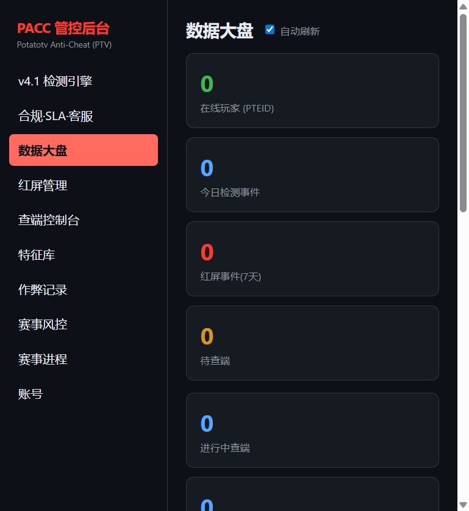

# PACC 反作弊系统 · 零基础手把手部署教程

> 这份教程是给**完全不会用电脑**的读者看的。
> 每一个步骤都写得非常啰嗦，跟着做就能成功。教程开头会先讲"必备知识"，让你明白自己在做什么。

---

# 第一部分：开讲之前，先懂几个词（必备前置知识）

看不懂就跳过，用到的时候再回来看。但**强烈建议先读一遍**，后面才不会一头雾水。

### 1. "部署"是什么意思？

就是把一套软件，安装到一台电脑上，让它**一直运行**、别人能访问。

本教程要部署的软件叫 **PACC 反作弊系统**。它由几部分组成：

| 组成部分 | 通俗解释 |
|---|---|
| 数据库（MySQL） | 一个"大仓库"，专门存放账号、作弊记录、赛事数据 |
| 后端（Java 程序） | 系统的"大脑"，处理所有逻辑 |
| 前端（网页） | 你在浏览器里看到的管理页面 |
| 网关（nginx） | 一个"门卫"，负责把访问转到正确的程序 |

> 好消息：上面这些你**都不用单独安装**。我们用一个叫 **Docker** 的工具，一条命令全部自动装好。

### 2. 什么是 Docker？（装软件的神器）

想象你收到一个"集装箱"，里面装着运行整套软件所需的**所有零件**（数据库、程序、配置）。你只要把箱子放上船（启动容器），它就自己运转，不用你一个个装零件。

- **Docker Desktop** = 装在你电脑上的"集装箱码头"，负责装卸这些箱子。
- **容器（container）** = 装好并在运行的一个"箱子"。
- **镜像（image）** = 箱子里的"货物模板"，可复制多份。

### 3. 什么是"命令行 / 终端 / PowerShell"？

电脑有两种操作方式：
- **图形界面**：用鼠标点图标（平时用的就是这个）。
- **命令行**：用一个黑框框，靠**打字**指挥电脑。`PowerShell`、`终端(Terminal)` 都是命令行工具。

> 本教程的多数操作都要在命令行里打字。**打错了也没关系**，回车后会提示错误，照着改就行。复制粘贴命令即可，别自己打。

### 4. 什么是"服务器"？

一台**24 小时开机**、专门给别人提供服务的电脑，叫服务器。它一般不在你家，而在"云机房"（阿里云、腾讯云等），通过网络远程操作，叫**云服务器**。

- 自己电脑部署：适合**测试、试用**，电脑一关系统就停。
- 云服务器部署：适合**正式上线**，24 小时运行，别人随时能访问。

### 5. 什么是 SSH / 远程登录？

因为服务器不在你身边，你需要通过网络"远程进入"它进行操作。这个远程进入的动作，专业叫 **SSH**。你看到的画面是一个黑色命令行窗口，里面就是服务器。

### 6. 什么是"数据库"和"表"？

- **数据库（Database）**：一个仓库。
- **表（Table）**：仓库里的一个货架，专门放一类东西。比如"账号表"放账号、"作弊记录表"放作弊记录。
- **DDL**：给数据库下命令"创建一个货架"的语句，也就是建表语句。

> 本系统的表，**系统启动时会自动创建**，你不用手动建。教程后面提供完整 DDL 是为了让你理解每一张表存什么、每个字段什么意思。

---

# 第二部分：准备工作（先在自己电脑上装好工具）

## 2.1 需要的软件清单

| 软件 | 用来干嘛 | 必须装吗 |
|---|---|---|
| Docker Desktop | 一键启动整套系统 | ✅ 必须 |
| 浏览器 | 打开管理后台 | ✅ 电脑自带的 Edge 就行 |
| 记事本 | 改配置文件 | ✅ 电脑自带 |
| （可选）PuTTY / WinSCP | Linux 服务器专用 | 只用云服务器才需要 |

## 2.2 安装 Docker Desktop（Windows）

**第 1 步**：打开浏览器，地址栏输入并回车：

**`https://www.docker.com/products/docker-desktop/`**

**打开后屏幕长这样**：

```
┌──────────────────────────────────────────────┐
│ Docker Desktop │ 左边有 Install（安装）按钮 │
└──────────────────────────────────────────────┘
```

**第 2 步**：点击大按钮 **Download for Windows（下载 Windows 版）**，等待下载完成。

**第 3 步**：双击下载好的文件（名字类似 `Docker Desktop Installer.exe`）。

**第 4 步**：安装时弹出的所有窗口，一律点 **下一步 / Next / 同意 / I Agree / OK**，不要勾选或取消任何选项，**一路点到底**。

**第 5 步**：装完后**重启电脑**。

**第 6 步**：重启后，双击桌面或开始菜单的 **Docker Desktop** 图标。

**第 7 步**：第一次打开会要你同意条款，点 **Accept（同意）**。

**第 8 步**：等待右下角（任务栏）的**鲸鱼图标**变成**绿色**。

**看到这个画面就是装好了**：

```
┌──────────────────────────────┐
│ 🐳 Docker Desktop 已运行      │
│   （图标变绿 = 成功）          │
└──────────────────────────────┘
```

> ⚠️ 如果提示"需要启用 WSL2"，点确定让它自动处理；若报错见**第七部分常见问题**第 1 条。

---

# 第三部分：方法一 —— 在自己电脑上部署（最快体验）

> 适合：先看看系统长什么样、测试功能。你的电脑需要保持开机系统才运行。

## 3.1 把项目文件夹放到电脑里

**第 1 步**：把项目文件夹（包含 `docker-compose.yml`、`ptv-backend`、`ptv-frontend` 的那个文件夹）放到 `D:\pacc`（或任意位置，但**不要放桌面**）。

- 如果是压缩包：右键 → 解压到当前文件夹。
- 如果是 Git 仓库：需要先在电脑装 [Git](https://git-scm.com/download/win)，装好后在命令行执行 `git clone 仓库地址`。没有 Git 仓库就跳过。

**第 2 步**：确认文件夹里能看到 `docker-compose.yml` 这个文件（后面全靠它）。

## 3.2 创建配置文件 `.env`（填密码）

**第 1 步**：打开项目文件夹，找到 `env.example` 文件。

> 看不到？在文件夹顶部点"查看"→ 勾选"**文件扩展名**"，就能看到了。

**第 2 步**：右键 `env.example` → **复制** → 在空白处右键 → **粘贴**。

**第 3 步**：把粘贴出来的"`env.example - 副本`"重命名为 **`.env`**（注意开头有个点，`env` 后面没有后缀）。弹出确认框点"**是**"。

**第 4 步**：右键 `.env` → 打开方式 → **记事本**，找到下面几行，把 `=` 后面的内容改成你自己的密码（示例值仅供格式参考，请换成自己的）：

```
MYSQL_ROOT_PASSWORD=pacc-root-change-me
MYSQL_PASSWORD=pacc-secret-change-me
PACC_ADMIN_API_KEY=改成你的后台登录密钥（越长越好）
PACC_SECURITY_SUPER_ADMIN_KEY=改成超级管理员密钥
PACC_SECURITY_JWT_SECRET=改成令牌密钥（>=32字符）
PACC_SECURITY_WSS_SIGN_SECRET=改成WSS签名密钥（>=16字符）
```

**第 5 步**：按 **Ctrl + S** 保存，关闭记事本。

> ✅ **怎么检查**：`.env` 文件存在，且内容包含你改过的密码。
> ⚠️ **千万别把 `.env` 发给别人**，里面有密码。

## 3.3 打开命令行（PowerShell）

**第 1 步**：在项目文件夹的地址栏（最上面显示路径的地方）点一下，删除原有内容，输入 `powershell` 后按回车。

**做完的样子**：弹出一个黑色窗口，里面光标所在行末尾显示你项目的路径（比如 `PS D:\pacc>`）。这表示你已经"站在"项目文件夹里了。

## 3.4 一键启动系统

**第 1 步**：在黑色窗口里输入下面这行（或直接复制粘贴），然后按回车：

**`docker compose up -d --build`**

**怎么判断完成**：屏幕上会快速滚动很多文字（在下载软件零件）。**第一次要等 10～30 分钟**，耐心等待，别关窗口。等画面停下来、光标又能输入了，就说明完成了。

> 判断完成的标准：又出现了 `PS D:\pacc>` 这样的提示符，并且**没有大段红色报错**。

## 3.5 检查是否启动成功

**第 1 步**：输入下面命令，回车：

**`docker compose ps`**

**看到这张表就对了**：出现一张表格，里面能看到 `pacc-mysql`、`pacc-backend`、`pacc-frontend`、`pacc-gateway`，它们的 **STATUS** 一栏是 `healthy` 或 `Up`：

```
NAME            STATUS
pacc-mysql      Up (healthy)
pacc-backend    Up (healthy)
pacc-frontend   Up (healthy)
pacc-gateway    Up
```

- ✅ 全是 `healthy`/`Up` → 成功！进入 3.6。
- ⏳ 有 `starting` / `unhealthy` → 等 1～2 分钟，再输入一次 `docker compose ps`。
- ❌ 有 `Exited` / `Error` → 看第七部分常见问题。

## 3.6 打开管理后台

**第 1 步**：打开浏览器（Edge 或 Chrome 都行），在地址栏（最上面显示网址的那个长条框）里输入下面内容，按回车：

**`http://localhost:8081`**

**第 2 步**：回车后，看到**登录页面**，画面和下图一样：


**第 3 步**：在「管理员 API Key」输入框里**粘贴**你在 `.env` 里设置的 `PACC_ADMIN_API_KEY`（没改就是 `pacc-admin-secret-key`），点**登 录**按钮。

**第 4 步**：登录成功后，进入后台首页「数据大盘」，左侧有菜单（数据大盘、红屏管理、账号、赛事风控、赛事进程……），画面和下图一样：



> ✅ **至此，方法一完成！** 你已经成功部署了一套反作弊系统。
> 后台各页面具体长什么样，可查看 [screenshots 截图目录](screenshots) 或仓库根目录 README 中的「管理后台界面预览」。

---

# 第四部分：方法二 —— 部署到 Linux 云服务器（正式上线）

> 适合：让系统**7×24 小时**运行，别人在任何地方都能访问。下面以 **Ubuntu** 系统为例（最常用）。

## 4.1 买一台云服务器

**第 1 步**：去任意云厂商官网（阿里云 / 腾讯云 / 华为云等）注册账号。

**第 2 步**：购买"云服务器 ECS / CVM"，建议配置：

| 项目 | 建议 |
|---|---|
| 系统镜像 | **Ubuntu 22.04 LTS**（本教程以此为例） |
| CPU | 2 核 |
| 内存 | 4 GB 起 |
| 硬盘 | 40 GB 起 |
| 带宽 | 3 Mbps 起（人多再升级） |

**第 3 步**：购买时设置**服务器密码**，务必记下来（后面登录要用）。

**第 4 步**：买完后，在云厂商控制台找到服务器的**公网 IP**（一串数字，如 `47.xx.xx.xx`），记下来。

> 💡 云服务器一般都有"安全组"或"防火墙"设置，**后面（4.8）需要去开放端口**。

## 4.2 远程登录服务器（SSH）

**Windows 用户**：打开 PowerShell（开始菜单搜 `PowerShell` 回车），输入下面命令（把 IP 换成你的），回车：

**`ssh root@你的服务器公网IP`**

**第一次连会这样**：第一次连接会问 `Are you sure you want to continue connecting (yes/no)?`，输入 **yes** 回车；然后要你输入密码（输入时不显示字符，正常现象），输完回车。

看到下面这种字样 = **登录成功**：

```
Welcome to Ubuntu 22.04 LTS
root@你的服务器名:~#
```

> 从此刻起，你打的每条命令都是在**服务器**上执行，不是在你自己的电脑上。

## 4.3 更新服务器的"零件清单"

**第 1 步**：输入下面命令，回车（要输入密码的话就输入）：

**`sudo apt update`**

**第 2 步**：再输入，回车（中途问 Yes/No 就输入 `Y` 回车；**整个过程可能几分钟**）：

**`sudo apt upgrade -y`**

**完成标志**：屏幕滚动结束后，回到 `root@...#` 提示符，没有红色报错。

## 4.4 安装 Docker（服务器版）

**第 1 步**：输入下面命令，回车（官方一键安装脚本，**可能需要几分钟**）：

**`curl -fsSL https://get.docker.com | sh`**

**装好长这样**：最后几行出现类似 `Docker Engine ... installed` 的字样 = 装好了。

**第 2 步**：让当前账号能用 Docker（不加这一步会一直报权限错误），输入，回车：

**`sudo usermod -aG docker $USER`**

**第 3 步**：**重新登录一次**服务器让设置生效：输入 **`exit`** 回车，再按 4.2 的方式重新登录。

**第 4 步**：验证安装，输入，回车：

**`docker --version`**

**装好应该显示**：

```
Docker version 24.0.x, build xxxxxxx
```

**第 5 步**：再验证 compose（编排工具），输入，回车：

**`docker compose version`**

**出现这个版本号即成功**：`Docker Compose version v2.x.x`。

> 如果 `docker compose version` 报"command not found"，看常见问题第 6 条。

## 4.5 把项目代码放到服务器

**方式 A：从代码仓库拉取（推荐）**

**第 1 步**：安装 git，输入，回车：

**`sudo apt install -y git`**

**第 2 步**：拉取代码（换成你的仓库地址），输入，回车：

**`git clone 你的仓库地址`**

**方式 B：从你电脑上传（没有仓库时）**

在你自己的 Windows 电脑装 [WinSCP](https://winscp.net/eng/download.php)，用服务器的 IP + 密码登录，把整个项目文件夹**拖拽上传**到服务器 `/root/` 目录下。

## 4.6 创建配置文件 `.env`

**第 1 步**：进入项目文件夹（把命令里的名字换成实际文件夹名），输入，回车：

**`cd pacc`**

**第 2 步**：复制出 `.env` 配置文件，输入，回车：

**`cp .env.example .env`**

**第 3 步**：用 nano 编辑器打开 `.env`，输入，回车：

**`nano .env`**

**出现这个界面 = 成功**：全屏变成一个文本编辑界面，光标可移动。

**第 4 步**：用键盘**方向键**把光标移到要改的行，删掉旧内容、输入新值（至少改下面 6 行；密钥建议用超长随机字符串）：

```
MYSQL_ROOT_PASSWORD=改成你的数据库超级密码
MYSQL_PASSWORD=改成你的数据库普通密码
PACC_ADMIN_API_KEY=改成你的后台登录密钥  （越长越好）
PACC_SECURITY_SUPER_ADMIN_KEY=改成超级管理员密钥
PACC_SECURITY_JWT_SECRET=改成你的令牌密钥（>=32字符）
PACC_SECURITY_WSS_SIGN_SECRET=改成WSS签名密钥（>=16字符）
```

> ⚠️ **高级说明**：这 4 个密钥（Admin / SuperAdmin / JWT / WSS）是安全底线，**留空或用示例弱值，后端会拒绝启动**（fail-closed），避免带着弱口令上线。可用下面命令在电脑或服务器上生成一串随机字符填进去（把输出复制到对应行）：
> **`openssl rand -hex 48`**
> 生成 4 次，分别填给 4 个密钥，每次都不同。

**第 5 步**：保存退出：
1. 按 **Ctrl + O** → 回车（保存）
2. 按 **Ctrl + X**（退出）

**保存退出的标志**：回到 `root@...#` 提示符。

## 4.7 启动系统

**第 1 步**：输入下面命令，回车（**第一次 10～30 分钟**，别中断）：

**`docker compose up -d --build`**

**第 2 步**：验证，输入，回车：

**`docker compose ps`**

**全部 healthy 才算数**：`pacc-mysql / pacc-backend / pacc-frontend / pacc-gateway` 全部 `Up (healthy)`。

## 4.8 开放端口（关键，否则外面访问不了）

云服务器有两道"门"要打开：

**第 1 步（系统防火墙）**：输入，回车：

**`sudo ufw allow 80,443,8080,8081,3306/tcp`**

**第 2 步（云厂商安全组）**：登录云厂商控制台 → 找到这台服务器 → 找到"**安全组 / 防火墙规则**"→ 添加入方向规则，**放行**这些端口（协议 TCP）：

```
80、443、8080、8081、3306
```

> 来源填写 `0.0.0.0/0`（表示任何人可访问）或填写你常用 IP 更安全。

**第 3 步**：在你自己电脑的浏览器里访问：

**`http://你的服务器公网IP:8081`**

**能进后台就成功**：能看到和 3.6 一样的登录页面（见 `screenshots/tutorial-01-login.png`），用 `PACC_ADMIN_API_KEY` 登录进入后台。

> ✅ **至此，正式上线部署完成！** 服务器 24 小时运行，别人都能访问。

> 💡 **想一键完成 4.4→4.7 吗？** 仓库里准备了自动化脚本，它帮你装 Docker → 校验 `.env`（密钥不全/还是占位符会拒绝启动）→ 构建启动 → 等全部容器健康 → 做一次安全冒烟。配好 `.env` 后，在项目目录执行：<br>`chmod +x deploy/server/deploy-server.sh && ./deploy/server/deploy-server.sh`。详细见 `deploy/server/README.md`。

## 4.9 可选进阶：绑定域名 + HTTPS（有域名才做）

1. 在域名服务商后台，把 4 个子域名解析到服务器公网 IP：`admin`、`api`、`pacc`、`dl`（前缀 + 你的域名）。
2. 申请免费 HTTPS 证书（方法见仓库 `deploy/gateway/certs/README.md`）。
3. 把证书文件 `potatotv.asia.crt`、`potatotv.asia.key` 放到服务器项目目录 `deploy/gateway/certs/` 下。
4. 重建网关：`docker compose up -d --build gateway`。

---

# 第五部分：数据库完全指南 + 完整建表 DDL（带注释）

## 5.1 数据库基础知识（通俗版）

- **数据库**：一个仓库。本系统用的数据库叫 **MySQL**。
- **表**：仓库里的货架。本系统一共有 **18 张表**。
- **字段（列）**：货架上的一格，存一种数据。比如"账号表"里有"邮箱"这一格、"密码"这一格。
- **主键（PRIMARY KEY）**：每个货架的唯一编号，靠它区分每一行数据。
- **DDL（建表语句）**：告诉数据库"造一个货架"的命令，用 SQL 语言写。

## 5.2 你需要手动建表吗？——**不需要**

系统在**首次启动时**会自动执行建表脚本（专业叫 **Flyway 数据库迁移**：后端启动自动跑 `db/migration/V1__init.sql`）**自动创建 18 张表**。

> 生产环境对表结构较严格（`ddl-auto: validate`，表结构与脚本不符会拒绝启动以免数据损坏）；本地测试环境则自动更新。**你都不用管，只要填对 `.env` 里的数据库密码就行。**

> 唯一要你做的：把 `.env` 里的数据库账号密码填对。**如果你不想看建表语句，直接跳到第六部分。**

如果你想看系统到底建了哪些表，进入数据库命令行（自己电脑或服务器上执行）：

**`docker exec -it pacc-mysql mysql -upacc -p`**

输入密码后，再输入下面命令查看所有表：

**`SHOW TABLES;`**

**看到这些表就对了**：列出 `t_account`、`t_device`、`t_login_event` 等 18 张表。

## 5.3 完整建表 DDL（参考 · 每条都带字段注释）

> ⚠️ 说明：以下 DDL 是"参考版"，帮你理解每张表和每个字段。系统**实际建表以仓库 `ptv-backend/src/main/resources/db/migration/V1__init.sql` 这份脚本为准**，与下表基本一致（个别字段名/字符集按脚本略有调整，例如布尔字段用 `TINYINT(1)` 与下表等价）。**不要手动执行这些语句**，系统启动会自动建好表。

### ① 账号表 t_account（玩家反作弊账号）

```sql
CREATE TABLE t_account (
    pteid                VARCHAR(255) NOT NULL COMMENT '账号唯一标识(PTEID)，系统自动生成，如PT1001',
    email                VARCHAR(255) NOT NULL COMMENT '登录邮箱，唯一',
    phone                VARCHAR(255) COMMENT '手机号(可空)',
    password_hash        VARCHAR(255) NOT NULL COMMENT '密码哈希值(Argon2id加盐)，禁止存明文',
    reputation           INT NOT NULL DEFAULT 100 COMMENT '信誉分(0-100)，作弊扣分',
    status               VARCHAR(255) NOT NULL DEFAULT 'normal' COMMENT '账号状态：normal正常/suspicious可疑/high_risk高危/locked_inspect锁定待查端',
    total_redscreen      INT NOT NULL DEFAULT 0 COMMENT '历史红屏次数',
    failed_logins        INT NOT NULL DEFAULT 0 COMMENT '连续登录失败次数(用于锁定)',
    device_fingerprint   VARCHAR(1024) COMMENT '绑定设备指纹(CPU/主板/硬盘/MAC组合)',
    registered_at        DATETIME(6) NOT NULL COMMENT '注册时间',
    last_red_screen_time DATETIME(6) COMMENT '最近一次红屏时间',
    locked_until         DATETIME(6) COMMENT '锁定截止时间(空=未锁定)',
    PRIMARY KEY (pteid),
    UNIQUE KEY uk_account_email (email)
) COMMENT='反作弊账号表，账号体系与游戏账号完全解耦';
```

### ② 设备表 t_device（账号登录过的设备）

```sql
CREATE TABLE t_device (
    device_id          VARCHAR(255) NOT NULL COMMENT '设备标识(由pteid+指纹哈希派生)',
    pteid              VARCHAR(255) COMMENT '所属账号',
    device_fingerprint VARCHAR(1024) COMMENT '脱敏设备指纹(社区不暴露明文指纹)',
    platform           VARCHAR(255) COMMENT '平台：Windows/Android/iOS等',
    device_name        VARCHAR(255) COMMENT '设备名称',
    ip                 VARCHAR(255) COMMENT '登录来源IP',
    first_login_at     DATETIME(6) COMMENT '首次登录时间',
    last_login_at      DATETIME(6) COMMENT '最近登录时间',
    active             TINYINT(1) DEFAULT 0 COMMENT '是否当前正在使用的设备：1是 0否',
    PRIMARY KEY (device_id)
) COMMENT='账号登录设备表，标记当前使用设备';
```

### ③ 外设表 t_peripheral（设备上使用过的外设）

```sql
CREATE TABLE t_peripheral (
    peripheral_id      VARCHAR(255) NOT NULL COMMENT '外设标识',
    pteid              VARCHAR(255) COMMENT '所属账号',
    device_fingerprint VARCHAR(1024) COMMENT '归属设备的指纹',
    kind               VARCHAR(255) COMMENT '外设类型：mouse鼠标/keyboard键盘/headset耳机/gamepad手柄/usb_storageU盘/dongle接收器/monitor显示器',
    vendor             VARCHAR(255) COMMENT '厂商',
    model              VARCHAR(255) COMMENT '型号',
    connected          TINYINT(1) DEFAULT 0 COMMENT '当前是否正在使用：1是 0否',
    first_seen_at      DATETIME(6) COMMENT '首次出现时间',
    last_seen_at       DATETIME(6) COMMENT '最近出现时间',
    PRIMARY KEY (peripheral_id)
) COMMENT='外设记录表，用于设备画像';
```

### ④ 登录事件表 t_login_event（每次登录记录，风控聚合底座）

```sql
CREATE TABLE t_login_event (
    id                 BIGINT NOT NULL AUTO_INCREMENT COMMENT '自增主键',
    pteid              VARCHAR(255) COMMENT '登录的账号',
    device_fingerprint VARCHAR(1024) COMMENT '本次登录所用设备指纹',
    ip                 VARCHAR(64) COMMENT '来源IP',
    created_at         DATETIME(6) COMMENT '登录时间',
    PRIMARY KEY (id),
    KEY idx_login_pteid (pteid),
    KEY idx_login_ip (ip)
) COMMENT='玩家登录事件表，供代练/共享/多IP宏观风控聚合';
```

### ⑤ 检测事件表 t_detection_event（玩家端上报的检测）

```sql
CREATE TABLE t_detection_event (
    id                VARCHAR(255) NOT NULL COMMENT '事件ID',
    pteid             VARCHAR(255) COMMENT '所属账号',
    event_type        VARCHAR(255) COMMENT '事件类型：memory_tamper内存篡改/process_injection进程注入/auto_clicker自动点击/java_mod模组等',
    severity          VARCHAR(255) COMMENT '严重度：low低/medium中/high高/critical严重',
    edition           INT COMMENT '游戏版本：0=基岩版 1=Java版',
    client_risk_score INT COMMENT '端侧预评分(0-100)',
    process_name      VARCHAR(255) COMMENT '证据：相关进程名',
    memory_region     VARCHAR(255) COMMENT '证据：内存区域',
    signature_hit     VARCHAR(255) COMMENT '证据：命中的特征码',
    detail_json       VARCHAR(255) COMMENT '证据：详情JSON(可含行为特征)',
    client_version    VARCHAR(255) COMMENT '客户端版本',
    os_info           VARCHAR(255) COMMENT '操作系统信息',
    occurred_at       DATETIME(6) COMMENT '发生时间',
    PRIMARY KEY (id)
) COMMENT='检测事件表，数据仅来自玩家本地采集';
```

### ⑥ 作弊记录表 t_cheat_record（永久留存）

```sql
CREATE TABLE t_cheat_record (
    record_id          VARCHAR(255) NOT NULL COMMENT '记录ID',
    pteid              VARCHAR(255) COMMENT '作弊账号',
    alert_id           VARCHAR(255) COMMENT '关联的红屏告警ID(用于误报时精确撤销)',
    cheat_type         VARCHAR(255) COMMENT '作弊类型(如 killaura/autoclicker 等)',
    level              INT COMMENT '严重等级',
    risk_score         INT COMMENT '风险分',
    prev_hash          VARCHAR(255) COMMENT '证据哈希链：前一条哈希',
    record_hash        VARCHAR(255) COMMENT '本条证据哈希(防篡改)',
    inspect_conclusion VARCHAR(255) COMMENT '查端结论',
    revoked            TINYINT(1) DEFAULT 0 COMMENT '是否已撤销：1是 0否',
    occurred_at        DATETIME(6) COMMENT '发生时间',
    PRIMARY KEY (record_id)
) COMMENT='并机警告/作弊记录，永久留存';
```

### ⑦ 红屏告警表 t_redscreen_alert（系统唯一威慑手段）

```sql
CREATE TABLE t_redscreen_alert (
    alert_id         VARCHAR(255) NOT NULL COMMENT '告警ID',
    level            INT COMMENT '红屏等级：2=二级(确认作弊) 3=三级(严重作弊)',
    cheat_type       VARCHAR(255) COMMENT '作弊类型',
    pteid_masked     VARCHAR(255) COMMENT '脱敏账号(社区展示用，隐藏全量)',
    pteid            VARCHAR(255) COMMENT '作弊账号全量(仅后台可见)',
    risk_score       INT COMMENT '风险分',
    edition          VARCHAR(255) COMMENT '游戏版本：BEDROCK/JAVA',
    state            VARCHAR(255) DEFAULT 'PENDING_INSPECT' COMMENT '状态：PENDING_INSPECT待查端/CONFIRMED已确认/FALSE_POSITIVE误报',
    inspect_conclusion VARCHAR(255) COMMENT '查端结论',
    broadcast_online BIGINT COMMENT '在线广播覆盖人数',
    broadcast_ack    BIGINT COMMENT '在线确认人数',
    occurred_at      DATETIME(6) COMMENT '发生时间',
    resolved_at      DATETIME(6) COMMENT '解决时间(空=未解决)',
    PRIMARY KEY (alert_id)
) COMMENT='红屏警告事件表，系统不封禁仅警告';
```

### ⑧ 查端会话表 t_inspect_session（管理员远程查端）

```sql
CREATE TABLE t_inspect_session (
    session_id  VARCHAR(255) NOT NULL COMMENT '查端会话ID',
    pteid       VARCHAR(255) COMMENT '被查账号',
    alert_id    VARCHAR(255) COMMENT '关联的红屏告警ID',
    operator    VARCHAR(255) COMMENT '操作的管理员',
    state       VARCHAR(255) DEFAULT 'QUEUED' COMMENT '状态：QUEUED排队/ACTIVE进行中/DONE完成/TIMEOUT超时/CANCELLED取消',
    conclusion  VARCHAR(255) COMMENT '结论：confirmed确认作弊/false_positive误报/pending待定',
    audit_log   VARCHAR(255) DEFAULT '' COMMENT '全程审计留痕',
    expires_at  DATETIME(6) COMMENT '过期时间(单次查端最长30分钟)',
    started_at  DATETIME(6) COMMENT '开始时间',
    PRIMARY KEY (session_id)
) COMMENT='远程查端会话表(WebRTC取证通道)';
```

### ⑨ 特征库表 t_signature（作弊特征码库）

```sql
CREATE TABLE t_signature (
    id               VARCHAR(255) NOT NULL COMMENT '特征ID',
    name             VARCHAR(255) COMMENT '特征名称',
    pattern          VARCHAR(255) COMMENT '特征码(支持通配符??)',
    risk_level       INT COMMENT '风险等级(1-5)',
    edition          INT COMMENT '版本：0=基岩版 1=Java版 2=通用',
    library_version  VARCHAR(255) COMMENT '特征库版本',
    state            VARCHAR(255) DEFAULT 'DRAFT' COMMENT '状态：DRAFT草稿/PUBLISHED已发布/GRAY灰度/ROLLED_BACK已回滚',
    gray_percent     INT COMMENT '灰度发布比例(0-100)',
    created_by       VARCHAR(255) COMMENT '创建人',
    created_at       DATETIME(6) COMMENT '创建时间',
    PRIMARY KEY (id)
) COMMENT='特征库特征码表，支持灰度发布与回滚';
```

### ⑩ 客服工单表 t_support_ticket（多渠道客服）

```sql
CREATE TABLE t_support_ticket (
    ticket_id   VARCHAR(255) NOT NULL COMMENT '工单ID',
    pteid       VARCHAR(255) COMMENT '提交玩家',
    channel     VARCHAR(255) COMMENT '渠道：email邮件/qq/discord/ticket工单/admin管理员专属',
    subject     VARCHAR(255) COMMENT '工单标题',
    body        VARCHAR(255) COMMENT '工单内容',
    status      VARCHAR(255) DEFAULT 'open' COMMENT '状态：open待处理/in_progress处理中/resolved已解决/closed已关闭',
    assignee    VARCHAR(255) COMMENT '处理人',
    resolution  VARCHAR(255) COMMENT '解决方案',
    created_at  DATETIME(6) COMMENT '创建时间',
    updated_at  DATETIME(6) COMMENT '更新时间',
    PRIMARY KEY (ticket_id)
) COMMENT='多渠道客服工单表';
```

### ⑪ 申诉表 t_appeal（玩家在线申诉）

```sql
CREATE TABLE t_appeal (
    appeal_id      VARCHAR(255) NOT NULL COMMENT '申诉ID',
    pteid          VARCHAR(255) COMMENT '申诉玩家',
    alert_id       VARCHAR(255) COMMENT '关联的红屏告警ID(可选)',
    reason         VARCHAR(255) COMMENT '申诉原因',
    description    VARCHAR(255) COMMENT '申诉描述',
    status         VARCHAR(255) DEFAULT 'pending' COMMENT '状态：pending待处理/approved已通过/rejected已驳回',
    reviewer       VARCHAR(255) COMMENT '处理人',
    review_comment VARCHAR(255) COMMENT '处理意见',
    created_at     DATETIME(6) COMMENT '提交时间',
    reviewed_at    DATETIME(6) COMMENT '处理时间',
    PRIMARY KEY (appeal_id)
) COMMENT='玩家红屏/误报申诉表';
```

### ⑫ 报名表 t_enrollment（参赛门禁）

```sql
CREATE TABLE t_enrollment (
    enrollment_id                VARCHAR(255) NOT NULL COMMENT '报名ID',
    tournament_id                VARCHAR(255) COMMENT '赛事ID(空=通用联赛)',
    pteid                        VARCHAR(255) COMMENT '报名账号',
    display_name                 VARCHAR(255) COMMENT '参赛昵称',
    permitted_device_fingerprint VARCHAR(1024) COMMENT '许可的设备指纹(脱敏)，比赛必须用此设备',
    status                       VARCHAR(255) COMMENT '状态：PENDING待审批/APPROVED已通过/REJECTED已拒绝',
    created_at                   DATETIME(6) COMMENT '报名时间',
    approved_at                  DATETIME(6) COMMENT '审批时间',
    operator                     VARCHAR(255) COMMENT '操作人',
    note                         VARCHAR(255) COMMENT '备注(如拒绝原因)',
    team_name                    VARCHAR(255) COMMENT '队伍名',
    team_color                   VARCHAR(255) COMMENT '队伍徽章颜色(十六进制，如#58a6ff)',
    PRIMARY KEY (enrollment_id),
    KEY idx_enroll_pteid (pteid),
    KEY idx_enroll_tourney (tournament_id)
) COMMENT='参赛报名表，绑定账号与许可设备';
```

### ⑬ 对局会话表 t_match_session（对局入场令牌）

```sql
CREATE TABLE t_match_session (
    match_id          VARCHAR(255) NOT NULL COMMENT '对局ID(即随机入场token)',
    tournament_id     VARCHAR(255) COMMENT '赛事ID',
    pteid             VARCHAR(255) COMMENT '选手账号',
    device_fingerprint VARCHAR(1024) COMMENT '该场允许使用的设备指纹(报名时许可设备快照)',
    status            VARCHAR(255) COMMENT '状态：ACTIVE进行中/ENDED已结束',
    started_at        DATETIME(6) COMMENT '开始时间',
    expires_at        DATETIME(6) COMMENT '过期时间',
    ended_at          DATETIME(6) COMMENT '结束时间',
    operator          VARCHAR(255) COMMENT '发起人',
    last_seen_at      DATETIME(6) COMMENT '最近活跃时间(刷新token用)',
    PRIMARY KEY (match_id),
    KEY idx_match_pteid (pteid),
    KEY idx_match_status (status)
) COMMENT='对局会话表，实现对局级设备隔离';
```

### ⑭ 嫌疑表 t_suspicion_flag（赛事风控嫌疑 + 证据哈希链）

```sql
CREATE TABLE t_suspicion_flag (
    flag_id          VARCHAR(255) NOT NULL COMMENT '嫌疑ID',
    pteid            VARCHAR(255) COMMENT '嫌疑账号',
    kind             VARCHAR(255) COMMENT '嫌疑类型：SHARED_ACCOUNT_MULTI_DEVICE同号多设备/SHARED_ACCOUNT_MULTI_IP同号多IP(代练)/DEVICE_FLAPPING设备指纹抖动/UNKNOWN',
    detail           VARCHAR(255) COMMENT '详情',
    weight           INT COMMENT '严重度权重(0-100)',
    evidence_summary VARCHAR(2048) COMMENT '证据摘要(参与哈希计算)',
    prev_chain_hash  VARCHAR(255) COMMENT '证据链：前一条嫌疑哈希(首条为genesis)',
    chain_hash       VARCHAR(255) COMMENT '本条证据哈希：SHA-256(前哈希+证据摘要)，防篡改',
    status           VARCHAR(255) COMMENT '状态：OPEN待复核/REVIEWED已复核/ESB禁赛',
    created_at       DATETIME(6) COMMENT '创建时间',
    reviewed_at      DATETIME(6) COMMENT '复核时间',
    reviewer         VARCHAR(255) COMMENT '复核人',
    review_comment   VARCHAR(255) COMMENT '复核意见',
    during_match     TINYINT(1) DEFAULT 0 COMMENT '是否发生在对局期间：1是 0否(公正性优先标记)',
    PRIMARY KEY (flag_id),
    KEY idx_flag_pteid (pteid),
    KEY idx_flag_status (status)
) COMMENT='赛事风控嫌疑表，证据哈希链不可静默篡改';
```

### ⑮ 赛程阶段表 t_tournament_stage（可自由编辑的赛程）

```sql
CREATE TABLE t_tournament_stage (
    stage_id       VARCHAR(255) NOT NULL COMMENT '阶段ID',
    tournament_id  VARCHAR(255) COMMENT '赛事ID',
    order_no       INT COMMENT '展示顺序(小号在前)',
    title          VARCHAR(255) COMMENT '阶段标题(如"线上资格赛BO1")',
    kind           VARCHAR(255) COMMENT '类别：QUALIFIER资格赛/GROUP小组赛/KNOCKOUT淘汰赛/FINAL决赛/CUSTOM自定义',
    status         VARCHAR(255) COMMENT '状态：PENDING待开始/ACTIVE进行中/DONE已结束',
    start_time     DATETIME(6) COMMENT '开始时间',
    end_time       DATETIME(6) COMMENT '结束时间',
    result_note    VARCHAR(255) COMMENT '结果备注(获胜PTEID/比分/说明)',
    note           VARCHAR(255) COMMENT '备注',
    created_at     DATETIME(6) COMMENT '创建时间',
    PRIMARY KEY (stage_id),
    KEY idx_stage_tourney (tournament_id)
) COMMENT='赛事阶段表，每届赛制不同可自由编排';
```

### ⑯ 赛事公告表 t_tournament_notice

```sql
CREATE TABLE t_tournament_notice (
    notice_id     VARCHAR(255) NOT NULL COMMENT '公告ID',
    tournament_id VARCHAR(255) COMMENT '赛事ID',
    title         VARCHAR(255) COMMENT '公告标题',
    content       VARCHAR(4000) COMMENT '公告内容(赛制/对阵/提醒/成绩公示等)',
    pinned        TINYINT(1) DEFAULT 0 COMMENT '是否置顶：1是 0否',
    operator      VARCHAR(255) COMMENT '发布人',
    created_at    DATETIME(6) COMMENT '发布时间',
    updated_at    DATETIME(6) COMMENT '更新时间',
    PRIMARY KEY (notice_id),
    KEY idx_notice_tourney (tournament_id)
) COMMENT='赛事公告表，报名选手门户可见';
```

### ⑰ 赛事配置表 t_tournament_config（报名配置，一届一份）

```sql
CREATE TABLE t_tournament_config (
    tournament_id   VARCHAR(255) NOT NULL COMMENT '赛事ID(主键，一场赛事一份配置)',
    title           VARCHAR(255) COMMENT '赛事名称',
    tencent_doc_url VARCHAR(2000) COMMENT '腾讯文档收集表链接(选手填资料用)',
    apply_deadline  DATETIME(6) COMMENT '报名截止时间',
    allow_register  TINYINT(1) DEFAULT 1 COMMENT '是否开放报名：1开放 0截止',
    note            VARCHAR(255) COMMENT '备注',
    updated_at      DATETIME(6) COMMENT '更新时间',
    PRIMARY KEY (tournament_id)
) COMMENT='赛事报名配置表';
```

---

# 第六部分：常用命令速查（建议抄下来）

| 我想做什么 | 在项目文件夹的命令行里输入 |
|---|---|
| 查看所有容器状态 | `docker compose ps` |
| 启动系统 | `docker compose up -d --build` |
| 停止系统（数据保留） | `docker compose down` |
| 停止并清空全部数据（慎用！） | `docker compose down -v` |
| 看后端运行日志 | `docker compose logs -f ptv-backend` |
| 看前端日志 | `docker compose logs -f ptv-frontend` |
| 看数据库日志 | `docker compose logs -f mysql` |
| 重启某个服务 | `docker compose restart ptv-backend` |
| 进入数据库命令行 | `docker exec -it pacc-mysql mysql -upacc -p` |
| 查看所有数据表 | 进入数据库后执行 `SHOW TABLES;` |

---

# 第七部分：常见问题排查 + 错误提示解决

### 1. Docker Desktop 报"WSL 更新失败 / 打不开"

- 重启电脑后再开一次 Docker Desktop。
- 开始菜单搜"**启用或关闭 Windows 功能**"→ 勾选"**适用于 Linux 的 Windows 子系统**"和"**虚拟机平台**"→ 确定 → 重启。
- 仍失败：先装 WSL2 内核，官方地址 `https://aka.ms/wsl2kernel`，装完重启。

### 2. `docker compose` 提示"不是内部或外部命令"

Docker 没装好或没启动。确认任务栏 Docker 鲸鱼图标是**绿色**后再试。

### 3. 启动时报"端口被占用"（含 `Bind for 0.0.0.0:8080 failed: port is already allocated`）

说明 8080/8081/3306 等端口已被别的程序占用。二选一：
- 关掉占用端口的程序；
- 或修改 `.env` 里的端口（如 `PACC_BACKEND_PORT=8082`），然后重新 `docker compose up -d --build`。

### 4. 容器状态是 `Exited` 或一直 `restarting`

- 先看日志找原因：`docker compose logs ptv-backend`。
- 常见原因：`.env` 密码没改干净、或内存不足。给服务器加内存，或先停掉无关程序。
- 修改 `.env` 后**必须重新构建**：`docker compose up -d --build`。

### 5. 网页打开但登录失败

- 确认输入的密钥 = `.env` 里的 `PACC_ADMIN_API_KEY`（**复制粘贴**，别手打）。
- 改过 `.env` 后要重新 `docker compose up -d --build` 才生效。

### 6. 服务器上 `docker compose version` 报 `command not found`

- 先确认 Docker 装好：`docker --version`。
- 若 Docker 装了但 compose 没有：执行 `sudo apt install -y docker-compose-plugin`，再验证。
- 老版本系统可临时用 `docker-compose`（带横杠）命令代替 `docker compose`。

### 7. 云服务器上浏览器访问 `http://IP:8081` 打不开

几乎都是**端口没放行**：
- 检查云厂商"安全组"是否放行 8080、8081（见 4.8）；
- 检查系统防火墙：`sudo ufw status`，必要时 `sudo ufw allow 8081/tcp`；
- 确认访问地址用的公网 IP 而不是内网 IP。

### 8. SSH 连不上服务器 / 提示 permission denied

- 确认用户名是 `root`（或你购买时设置的用户名）；
- 确认密码没记错（输密码时不显示是正常现象）；
- 云厂商控制台可"重置密码"，重置后重启服务器再试。

### 9. 登录后台后看不到演示数据

- 确认 `.env` 里 `PACC_SEED=true`；
- 数据库里已有旧数据时不会重复灌入。可清空重来：`docker compose down -v` 后重新 `up -d --build`（⚠️ 会清掉所有数据）。

### 10. 误执行了 `docker compose down -v`，数据没了怎么办

- 此命令会**永久删除**数据库数据卷。**没有后悔药**，请养成定期备份数据库的习惯：
  - **`docker exec pacc-mysql sh -c 'exec mysqldump -upacc -p"$MYSQL_PASSWORD" pacc' > backup.sql`**

---

# 第八部分：每一步的预期结果速查清单（对表自查）

| 步骤 | 你看到什么 = 做对了 |
|---|---|
| 安装 Docker Desktop | 鲸鱼图标变绿 |
| 创建 `.env` | 项目文件夹出现 `.env` 文件 |
| `docker compose up -d --build` | 命令结束回到提示符，无红色报错 |
| `docker compose ps` | mysql/backend/frontend/gateway 都是 `Up` 或 `healthy` |
| 访问 `http://localhost:8081` | 出现登录页面 |
| 输入密钥登录 | 进入后台，看到左侧菜单 |
| SSH 登录服务器 | 看到 `Welcome to Ubuntu ... root@...#` |
| 安装 Docker | `docker --version` 输出版本号 |
| 服务器上 `docker compose ps` | 全部 `Up (healthy)` |
| 访问 `http://服务器IP:8081` | 出现登录页面 |

---

*如果你按教程做了仍然报错，请把**屏幕上红色报错的截图**发给技术人员，并说明你做到哪一步。*

*配套快速版见 [部署说明-零基础版.md](部署说明-零基础版.md)；用宝塔面板部署见 [宝塔面板部署教程.md](宝塔面板部署教程.md)。*
